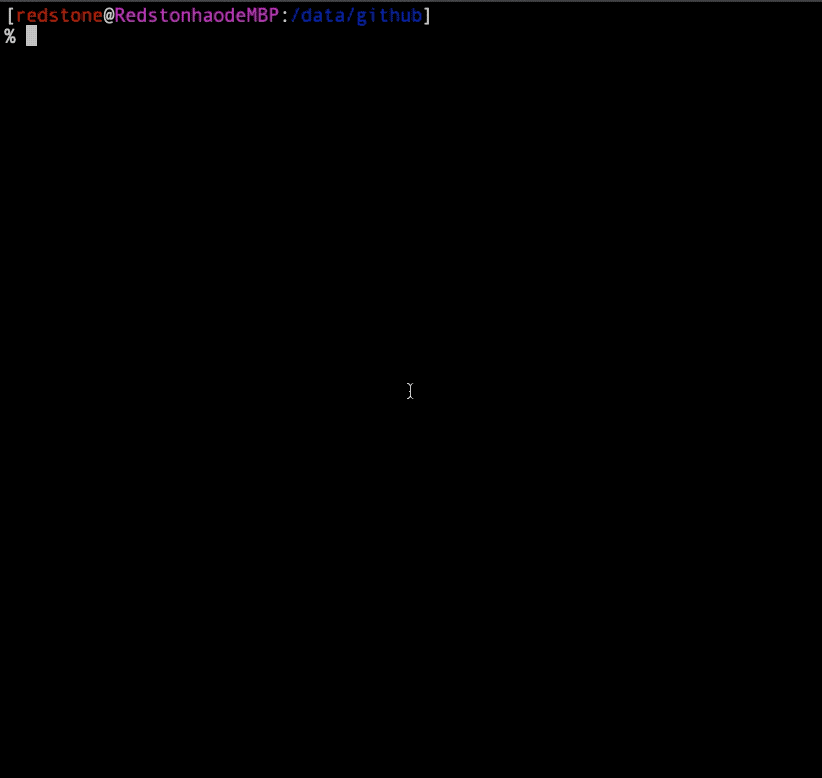

# @open-node/antman 窥探进程内部，让 Node.js 生产环境线上调试成为可能

## 解决了什么问题?

日常在开发服务端代码，很多是服务类型的，比如基于http的api，或者一些任务脚本，需要长时间驻留系统来处理消息队列，这些进程一旦发生bug，有时候很难还原发生bug时进程中个变量的状态。比如常见的内存溢出，这些情况发生后，排查问题非常吃力，因为很多时候进程只是崩掉了，或者输出了一大堆晦涩难懂的错误信息。排查此类问题，一般的做法就在各个关键点输出大量的日志，后期分析日志。而很多时候如果程序启动前没有加入日志的采集就很难在不重启的情况下有所收获了。

## 那遇到这种情况能怎么办?
* @open-node/antman 这个项目就是基于此痛点开发的, 项目的出发点是在进程启动的时候提前设置好一些需要查看的关键变量，之后通过socket服务，可以让外部通过链接提供的socket服务来随时查看，或者改变这些变量。而这个过程中，进程完全无需重启

* @open-node/antman 包含两部分功能，一部分在进程代码中引入，并且把需要调试查看的变量注册上去
另一部分功能是一个命令行工具，用来充当客户端，用来连接启动了调试功能的socket服务，从而实现进程的调试

* @open-node/antman 的做用户正如其名一样，类似于一个蚁人，可以进到进程内部，帮你查看或者改变一些变量，而且重要的是这个过程中进程并不需要重启, 所以也可以利用这个来做一些功能开关的管理，可以随时打开或者关闭某些开关。

## 开放了socket接口用来调试进程，会不会被攻击
* 理论上，确实需要注意这个问题，所以 @open-node/antman 项目内部提供了身份验证，利用了google 身份认证算法，口令通过私钥动态计算，每隔30秒变化一次。因此安全性可以得到保证。另外socket链接有两种模式，一种是sock文件来建立连接，只要保证sock文件不被别人读取到即可，另外一种是ip和端口，为了增强安全性，可以绑定端口到内网ip上，这样只有同一内网才可以访问。可以极大的提升安全性.

## @open-node/antman 用法直接参考项目的README

<pre>npm install @open-node/antman </pre>
<pre>npm install @open-node/antman -g </pre>

## 操作简单DEMO

## 项目地址
[@open-node/antman](https://github.com/open-node/antman)
